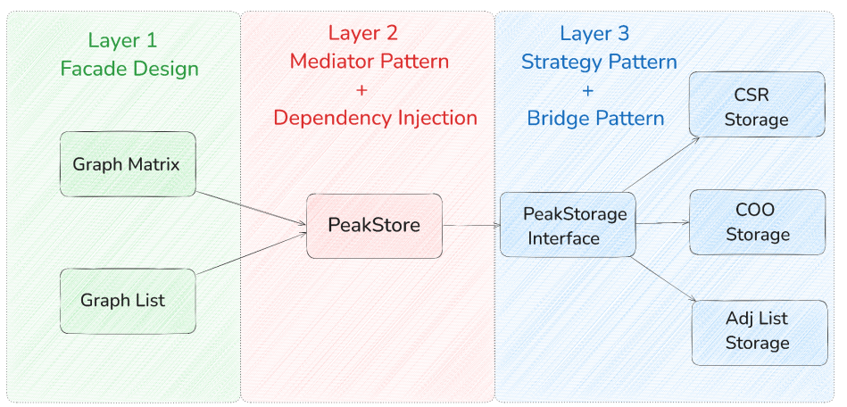
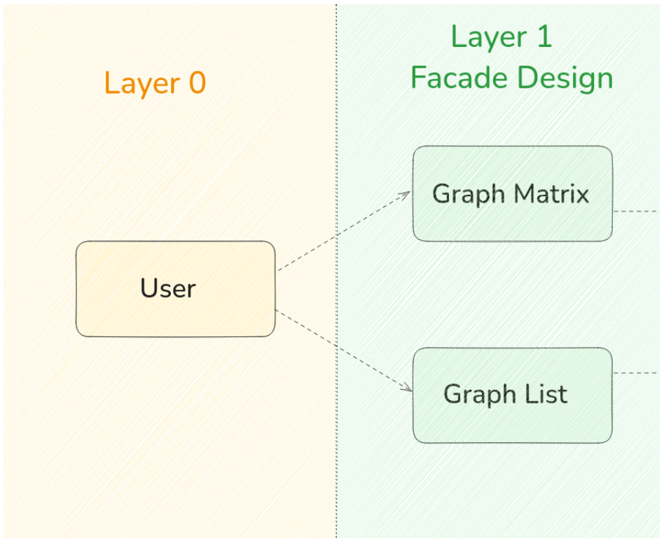
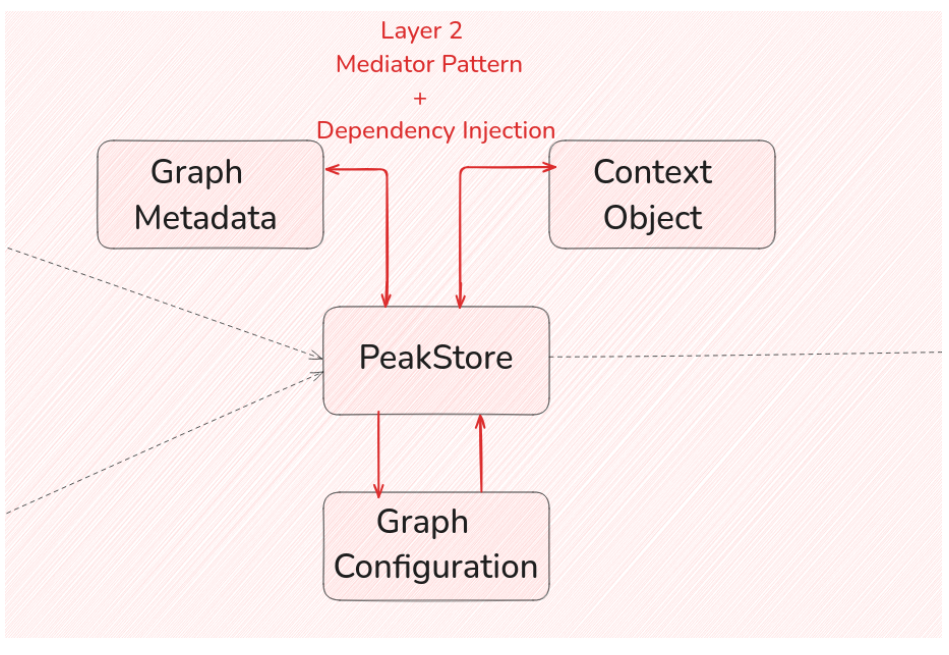
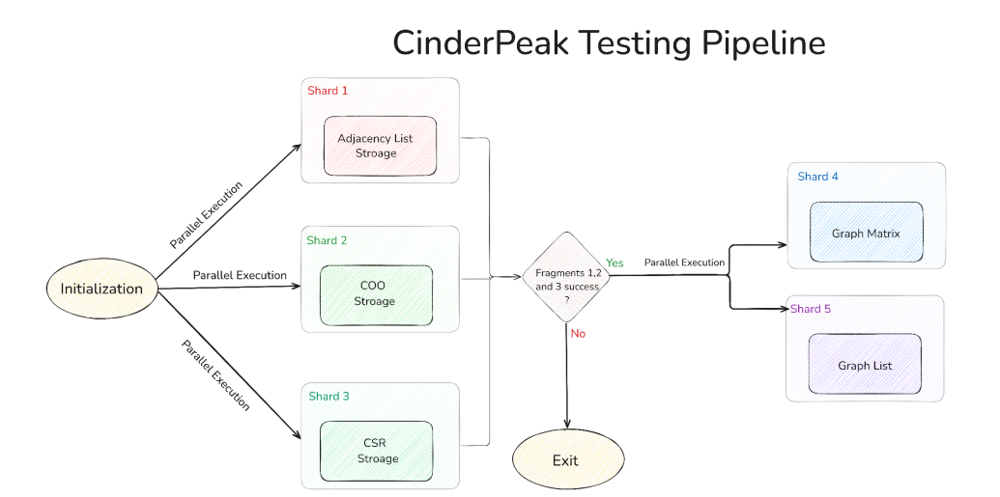

# CinderPeak Architecture Documentation

## 1. High Level Design

CinderPeak follows the Separation of Concerns principle and implements a layered architecture, ensuring that each component has a clearly defined responsibility. This applies to both the user-facing API and the storage engine (PeakStore). The design aims to make the system modular, extensible, and easy to maintain, while also enabling targeted optimizations.

The communication model consists of three layers, each with distinct roles, data flow constraints, and synchronized operations.

### 1.1 Layer Overview

The three primary layers are:

Layer 1 — User API Layer (Facade)

Layer 2 — Internal Storage Orchestrator (PeakStore)

Layer 3 — Concrete Storage Backends

Each layer follows specific design patterns, as illustrated below:

*
Fig 1.1: Design Pattern of each layer
*

### 1.2 Layer Communication Flow

Communication between layers can be unidirectional or bidirectional, but with strict ordering:
Layer 1 ↔ Layer 2 ↔ Layer 3.

*
Fig 1.1: Bidirectional layer communication flow
*

Direct jumps between non-adjacent layers are not allowed.
For example, Layer 1 cannot directly access Layer 3 — it must go through Layer 2.

**Note**: Layer 0 (not shown) is the user side code or the code accessing layer 1 from the user's end, which calls the Layer 1 APIs.

## 2 Layer Details

### 2.1 Layer 1 — User API Layer (Facade)

Layer 1 is the entry point for all user interactions. It exposes a clean, minimal, and intuitive public API for operations like:

- Creating graphs

- Adding/removing vertices and edges

- Running graph algorithms

- Querying graph properties

Responsibilities:

- Translate high-level user calls into lower-level instructions.

- Provide error handling and validation before delegating to deeper layers.

- Keep the user isolated from internal complexities.

*
Fig 1.2: Layer 1 facade implementation
*

Design Pattern:
Layer 1 follows the Facade Pattern, meaning it serves as a “single doorway” into the system. The internal complexity of graph storage and operations is completely hidden from the user.

Example in action:
When a user calls ``graph.addEdge(1, 2)``, Layer 1 will:

1. Validate inputs (e.g., check that both vertices exist).

2. Forward the request to Layer 2 for processing.

### 2.2 Layer 2 - PeakStore (Storage Orchestrator)

Layer 2 is the heart of CinderPeak, responsible for managing all storage backends in Layer 3.

It acts as a mediator between the API (Layer 1) and actual storage implementations (Layer 3).

*
Fig 1.2: Layer 2 internal storage
*

Key responsibilities:

- Instantiate, manage, and dispose storage backends.

- Maintain a shared context object containing:

  - Storage flags (e.g., backend type, memory mode)

  - Active storage engine details

  - Graph-level configuration

  - Graph metadata (e.g., directed/undirected, weighted/unweighted)

- Translate generic graph operations into backend-specific calls.

Design Patterns Used:

1. Mediator Pattern — Simplifies communication between backends.

2. Dependency Injection — Passes the shared context into backends so they operate with consistent settings.

Example in action:
When addEdge reaches Layer 2, it determines whether the active backend is Adjacency List, CSR, or COO, and delegates the insertion accordingly.

### 2.3 Layer 3 - Storage Backends

Layer 3 contains concrete implementations for different graph storage formats:

- Adjacency List

- CSR (Compressed Sparse Row)

- COO (Coordinate List)

Future formats can be added without touching higher layers.

*
Fig 1.3: Storage implementations with Strategy+Bridge patterns
*

Core Principles:

- All backends inherit from a common StorageInterface.

- Each backend implements methods like:

  - addVertex

  - addEdge

  - removeEdge

  - getNeighbors

  - runQuery

Design Patterns Used:

- Strategy Pattern — Allows PeakStore to switch backends at runtime based on performance needs or user preference.

- Bridge Pattern — Decouples the abstraction (PeakStore) from the implementation (storage engines).

Example in action:
If the user switches from Adjacency List to CSR for performance reasons, Layer 2 simply updates the backend reference without needing to change Layer 1’s API or Layer 3’s logic.

## 3. Testing Pipeline

CinderPeak uses Google Test (GTest) for a mix of unit tests and integration tests across all layers and backends.

The testing workflow is modular, split into five independent pipeline shards. This ensures that storage-specific failures don’t block unrelated tests and allows selective execution for faster CI/CD runs.

Pipeline Shards:

- Shard 1: Tests Adjacency List backend

- Shard 2: Tests CSR(Compressed Sparse Row) backend

- Shard 3: Tests COO(Coordinate List) backend

- Shard 4: Tests Graph Matrix representation

- Shard 5: Tests Graph List representation

Execution Rules:

- Shards 1–3 run in parallel for efficiency.

- Shards 4–5 execute only if Shards 1–3 pass, ensuring no dependent failures.

*
Fig 6.1: Parallel test execution workflow
*

## Orchestration Tool:

All shards are managed by CinderFlow, the central test orchestrator, which:

- Runs tests locally and in CI/CD environments (GitHub Actions, GitLab CI, etc.)

- Supports selective shard execution

- Reports consolidated results

Example CI/CD flow:

1. Developer pushes code.

2. Shards 1–3 run in parallel.

3. If all pass, Shards 4–5 execute.

4. CinderFlow aggregates results and reports pass/fail status.